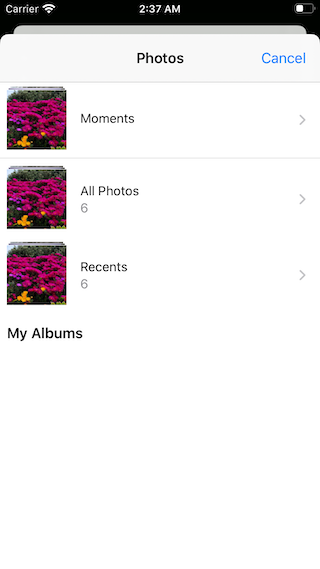
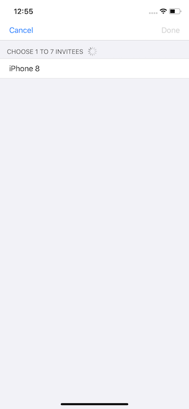
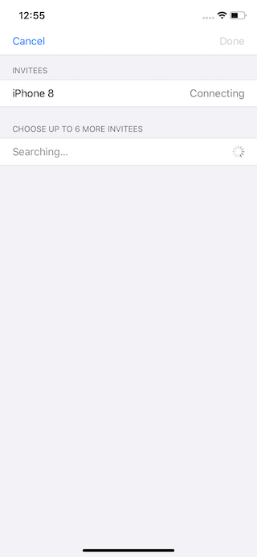
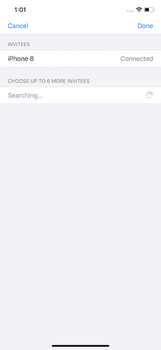
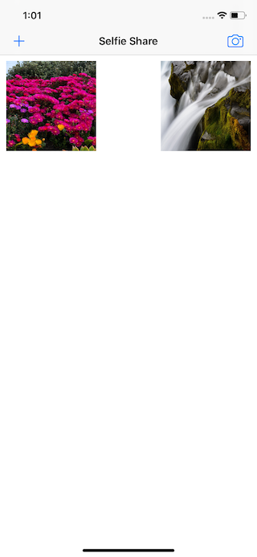

# Selfie Share (UIKit)

## Description
Make a multipeer photo sharing app in just 150 lines of code.

## Tags
This app has been worked through sections, so if you want to see an specific section, you can go through tags to take a look at them.

### importing-photos
| Screenshot 01 | Screenshot 02 |
| ------------- | ------------- |
|  |  |

| Screenshot 03 | Screenshot 04 |
| ------------- | ------------- |
|  |  |

### going-peer-to-peer
| Screenshot 05 | Screenshot 06 |
| ------------- | ------------- |
|  |  |

### invitation-only-updated
| Screenshot 07 | Screenshot 08 |
| ------------- | ------------- |
|  |  |

| Screenshot 09 | Screenshot 10 |
| ------------- | ------------- |
|  |  |

| Screenshot 11 |
| ------------- |
|  |